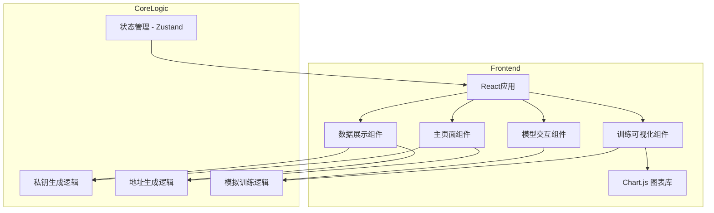
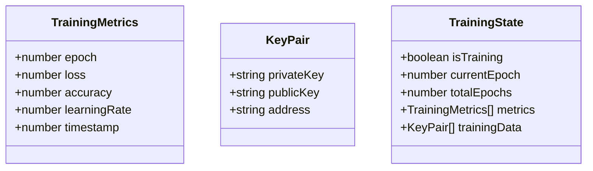

## 1. Architecture Design

## 2. Technology Description
- Frontend: React@18 + TypeScript + tailwindcss@3 + vite
- Initialization Tool: vite-init
- Backend: 无后端（纯前端应用）
- Database: 无
- 图表库: Chart.js
- 状态管理: Zustand
- 加密库: crypto-js (用于模拟加密过程)

## 3. Route Definitions
| Route | Purpose |
|-------|---------|
| / | 主页面，包含所有功能模块 |

## 4. API Definitions (if backend exists)
本项目为纯前端应用，无需后端API

## 5. Server Architecture Diagram (if backend exists)
不适用

## 6. Data Model (if applicable)
### 6.1 Data Model Definition

### 6.2 Data Definition Language
不适用（纯前端应用，无数据库）
