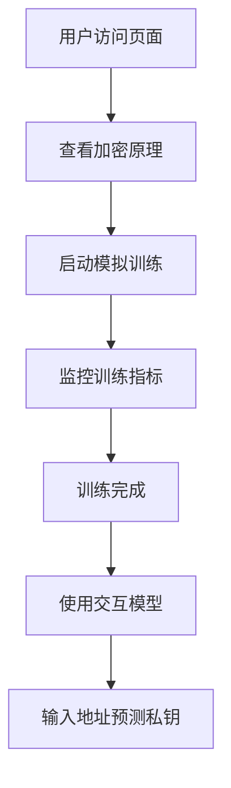

## 1. Product Overview
这是一个用于展示私钥-地址生成模型训练过程的交互式网页应用，通过模拟大模型训练让用户理解私钥与地址之间的关系，并提供直观的训练过程可视化。
- 主要功能：展示私钥生成地址的加密过程、模拟大模型训练过程、可视化训练指标、提供交互学习界面
- 目标用户：对区块链加密、机器学习感兴趣的学习者和开发者

## 2. Core Features

### 2.1 User Roles (if applicable)
无需用户角色区分，所有用户均可使用所有功能

### 2.2 Feature Module
1. **训练过程可视化页面**：展示模型训练进度、损失函数、准确率指标
2. **数据生成与展示模块**：生成随机私钥和对应地址，展示加密转换过程
3. **模型交互使用模块**：模拟使用训练后的模型，输入地址预测私钥
4. **学习说明模块**：解释私钥-地址生成原理和训练过程

### 2.3 Page Details
| Page Name | Module Name | Feature description |
|-----------|-------------|---------------------|
| 训练过程可视化 | 训练进度展示 | 实时显示训练轮数、损失值、准确率、学习率 |
| 训练过程可视化 | 指标图表 | 使用图表展示损失函数和准确率曲线 |
| 数据生成与展示 | 样本数据展示 | 展示批量生成的私钥-地址对样本 |
| 模型交互使用 | 输入预测 | 允许用户输入地址，查看模型预测的私钥结果 |
| 学习说明 | 加密过程说明 | 展示从私钥到地址的完整转换步骤 |

## 3. Core Process
用户访问页面 → 查看加密过程说明 → 启动模拟训练 → 查看训练指标和图表 → 使用交互模型进行预测测试

## 4. User Interface Design
### 4.1 Design Style
- 主色调：深色主题（深灰/黑色背景）配科技蓝渐变（#00d4ff 到 #0099ff）
- 按钮风格：圆角矩形，带有轻微阴影和发光效果
- 字体：使用 JetBrains Mono 等宽字体配合 Inter 无衬线字体
- 布局风格：卡片式网格布局，带霓虹边框效果
- 图标风格：使用简洁的线性图标，带有轻微发光效果

### 4.2 Page Design Overview
| Page Name | Module Name | UI Elements |
|-----------|-------------|-------------|
| 主页面 | Hero区域 | 大标题、副标题、渐变背景、按钮动画 |
| 主页面 | 训练控制面板 | 控制按钮、参数调节、进度条 |
| 主页面 | 指标展示区 | 卡片式指标展示、图表可视化 |
| 主页面 | 数据展示区 | 代码块、表格、滚动列表 |
| 主页面 | 交互区 | 输入框、预测结果展示 |

### 4.3 Responsiveness
桌面端优先设计，支持响应式布局，在平板和移动设备上适配显示

### 4.4 3D Scene Guidance (if applicable)
本项目暂不涉及3D场景
